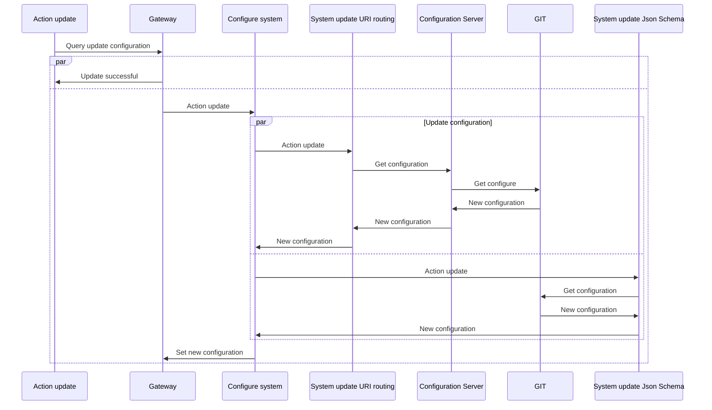
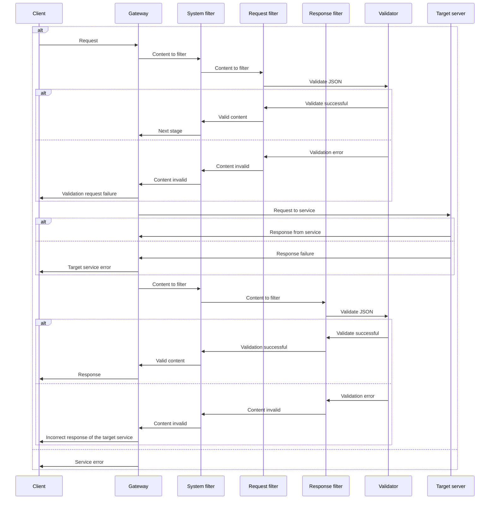
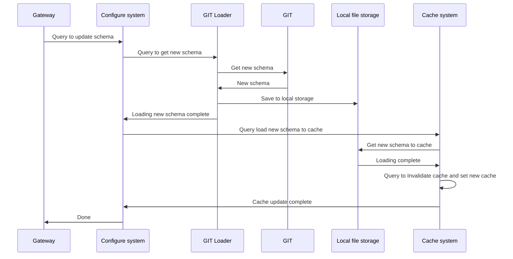

# Spring Cloud Gateway

Шлюз является входной точкой для всех запросов и на основе префикса в http адресе выполняет перенаправление на нужный
сервис, проверяет наличие и корректность токена аутентификации или перенаправляет на страницу авторизации.
Так же при необходимости он может выполнять валидацию входящих запросов и ответов на них.

## Как создать/отредактировать маршрут
* Маршруты задаются в файле конфигурации которые находятся в отдельном [репозитории](https://gitlab.sezinno.ru/lam/config) и получаются шлюзом от [Spring Configuration Server](https://gitlab.sezinno.ru/lam/configserver "Spring Configuration Server")
* Описывается он в секции как указано ниже. Необходимо указать id, префикс, путь назначения и при необходимости фильтры
    ```yaml
     spring:
       cloud:
         gateway:
           routes:
             - id: lam-core-route
               uri: lb://LamCore
               predicates:
                 - Path=/lam/**
               filters:
                 - RewritePath=/lam/(?<path>.*), /$\{path}
                 - RemoveRequestHeader= Cookie,Set-Cookie
    ```
* После изменения коммита изменений в репозитории gitlab отправит webhook на шлюз и начнется обновление конфигурации

## Валидация
* Так же как и маршруты (из пункта выше) задаются в файле конфигурации и обновляются по такому же принципу
* Есть возможность включения\отключения отдельно валидации запросов и ответов, задается булевым значением в секции
    ```yaml
      validate:
        requestOn: true
        responseOn: true
    ```
* В секции **request** и **response** указывается по очередности http метод, путь и корневая схема для валидации (добавляется в тот же репозиторий)
    ```yaml
    request:
      post:
        lam:
          user:
            adduser: request/addUser.json
      put:
        lam:
          user: request/editUser.json
    
    response:
      post:
        lam:
          user:
            adduser: response/addUser.json
    ```

## Алгоритм работы валидации при запуске приложения или обновлении конфигурации
1. JGit клонирует\обновляет удаленный [репозиторий](https://gitlab.sezinno.ru/lam/config) на локальную машину(локальный путь можно отредактировать в файле конфигурации).
2. Из локального репозитория выбираются все файлы с расширением .json и составляется Map ключом в которой является путь
   к файлу(относительно корня репозитория+его имя), а значением содержимое файла.
3. На основе секций **request** и **response** полученных из файла конфигурации от [Spring Configuration Server](https://gitlab.sezinno.ru/lam/configserver) формируется две Map с http методом запроса в виде ключа и строковым представлением пути запроса и имени схемы для него в виде значения.
4. Формируются две коллекции (для валидации запросов и ответов) которые содержат http метод, путь и схему (на основе пункта 2 и 3).
5. При получении входящего запроса и после того как он прошел проверку аутентификации если включена валидация запросов,
   то на основе его http метода и пути достается его схема из коллекции и выполняется валидация. В случае успеха он пропускается
   дальше к сервису назначения. В случае ошибки валидации или отсутствия схемы он отсекается и возвращается ответ с описанием ошибки.
6. Валидация ответов происходит аналогично валидации запросов из пункта 5, но в случае не пройденной валидации возвращается
   ошибка сервера, без описания ошибок валидации(они записываются в лог).

## Схема обновления конфигурации шлюза


## Схема работы валидатора шлюза


## Схема обновления схем для валидации
